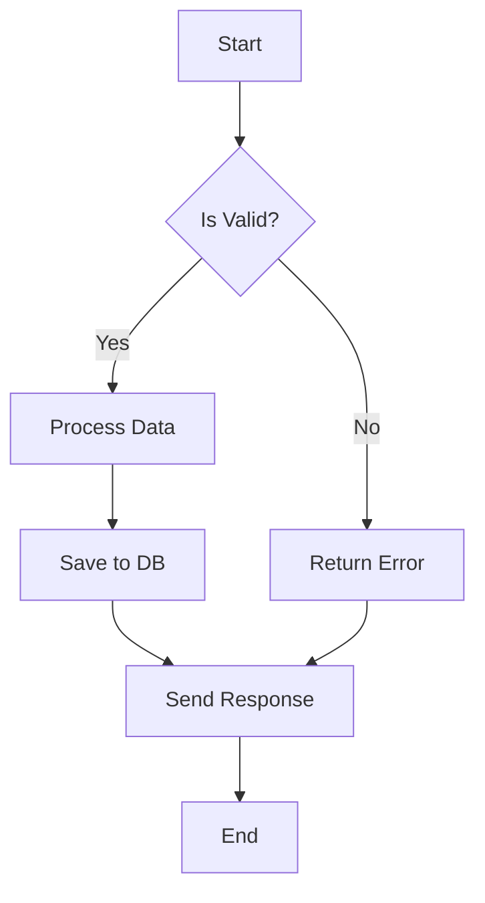
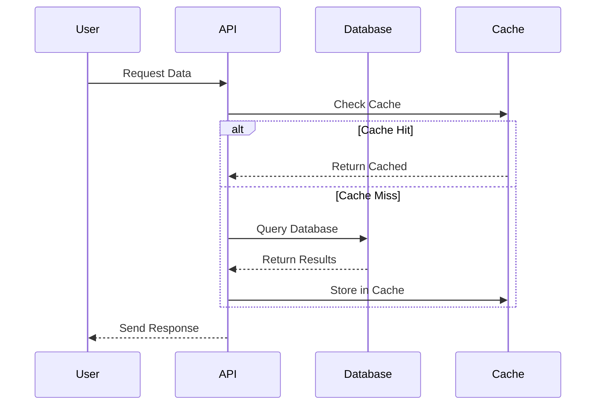
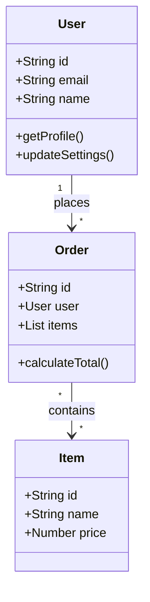
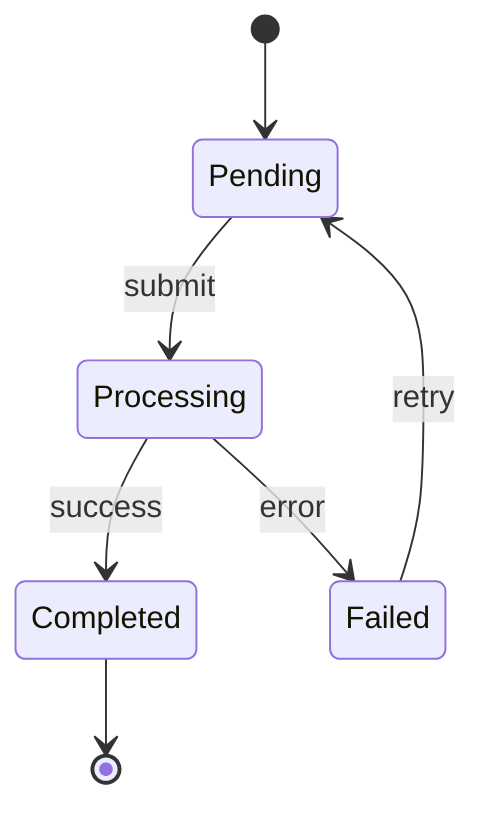
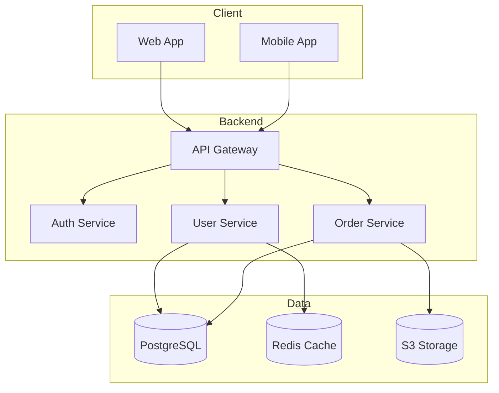

# Code Explanation Skill

Explain code clearly using ASCII diagrams, real-world analogies, and Mermaid visualizations.

## When to Use

- User asks "explain this code" or "what does this do"
- User wants to understand how something works
- User asks for architecture visualization
- User needs help understanding complex logic

## Explanation Framework

### Step 1: Quick Summary

Start with a one-sentence plain English summary:

> "This function takes a list of orders, filters out cancelled ones, calculates the total, and applies any applicable discounts."

### Step 2: Identify the Audience Level

Adjust explanation depth based on context:
- **Beginner**: Use analogies, avoid jargon, explain fundamentals
- **Intermediate**: Focus on patterns, design decisions, trade-offs
- **Expert**: Discuss edge cases, performance, alternatives

### Step 3: Break Down the Logic

Use structured sections:

1. **Purpose**: What problem does this solve?
2. **Inputs**: What data comes in?
3. **Process**: What transformations happen?
4. **Outputs**: What comes out?
5. **Side Effects**: What else changes?

## ASCII Diagram Patterns

### Data Flow

```
Input          Process           Output
  |               |                |
  v               v                v
+------+    +-----------+    +--------+
| User | -> | Validator | -> | Result |
| Data |    | Function  |    | Object |
+------+    +-----------+    +--------+
                 |
                 v
            +----------+
            | Database |
            +----------+
```

### Function Pipeline

```
[Raw Data]
     |
     v
+-------------+
| Parse JSON  |
+-------------+
     |
     v
+-------------+
| Validate    |
+-------------+
     |
   +-+-+
   |   |
   v   v
 Valid Invalid
   |     |
   v     v
+----+ +-------+
|Save| |Error  |
+----+ +-------+
```

### Class Relationships

```
     +----------------+
     |   BaseClass    |
     +----------------+
     | - privateVar   |
     | + publicMethod |
     +-------+--------+
             |
     +-------+-------+
     |               |
     v               v
+----------+   +----------+
| ChildA   |   | ChildB   |
+----------+   +----------+
| + methodA|   | + methodB|
+----------+   +----------+
```

### State Machine

```
         +--------+
         | START  |
         +---+----+
             |
             v
    +--------+--------+
    |                 |
    v                 v
+-------+        +--------+
| IDLE  |<------>| ACTIVE |
+---+---+        +----+---+
    |                 |
    v                 v
+-------+        +--------+
| ERROR |        | DONE   |
+-------+        +--------+
```

### Request/Response Flow

```
Client                   Server                  Database
  |                        |                        |
  |  1. POST /users        |                        |
  |----------------------->|                        |
  |                        |  2. INSERT INTO users  |
  |                        |----------------------->|
  |                        |                        |
  |                        |  3. Return new ID      |
  |                        |<-----------------------|
  |  4. 201 Created        |                        |
  |<-----------------------|                        |
  |                        |                        |
```

## Mermaid Diagram Generation

### Flowchart



### Sequence Diagram



### Class Diagram



### State Diagram



### Architecture Diagram



## Real-World Analogies

### Common Programming Concepts

| Concept | Analogy |
|---------|---------|
| **Variable** | A labeled box that stores something |
| **Function** | A recipe that takes ingredients and produces a dish |
| **Class** | A blueprint for building houses |
| **Instance** | An actual house built from the blueprint |
| **Interface** | A job contract specifying required skills |
| **Inheritance** | Children inheriting traits from parents |
| **Callback** | Leaving your phone number for a callback |
| **Promise** | An IOU note that will be fulfilled later |
| **Cache** | A sticky note reminder of frequently used info |
| **Queue** | A line at a coffee shop (FIFO) |
| **Stack** | A stack of plates (LIFO) |
| **Hash Map** | A library card catalog for quick lookups |
| **API** | A restaurant menu - shows what you can order |
| **Database** | A giant filing cabinet with organized folders |
| **Middleware** | Security checkpoints before entering a building |
| **Event Loop** | A receptionist handling one task at a time |

### Architecture Patterns

| Pattern | Analogy |
|---------|---------|
| **Microservices** | A food court with specialized restaurants |
| **Monolith** | A single restaurant doing everything |
| **Load Balancer** | A host at a busy restaurant seating guests |
| **Message Queue** | A post office sorting and delivering mail |
| **Circuit Breaker** | A fuse box that trips to prevent damage |
| **Pub/Sub** | A newspaper subscription service |

## Explanation Template

```markdown
## What This Code Does

{One-sentence summary}

## Visual Overview

{ASCII diagram or Mermaid diagram}

## Step-by-Step Breakdown

### 1. {First major step}
{Explanation with code snippet}

### 2. {Second major step}
{Explanation with code snippet}

## Analogy

Think of this like {real-world comparison}...

## Key Concepts

- **{Concept 1}**: {Brief explanation}
- **{Concept 2}**: {Brief explanation}

## Common Questions

**Q: Why is it done this way?**
A: {Explanation of design decision}

**Q: What could go wrong?**
A: {Edge cases and error scenarios}
```

## Tips

1. **Start simple**: Give the overview before diving into details
2. **Use visuals**: A diagram often explains better than paragraphs
3. **Relate to familiar concepts**: Analogies bridge the knowledge gap
4. **Show, don't just tell**: Include relevant code snippets
5. **Anticipate questions**: Address the "why" not just the "what"
